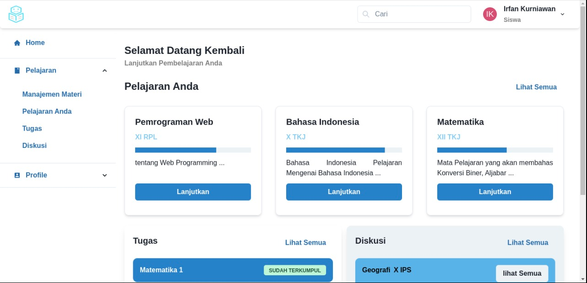

<!-- PROJECT LOGO -->
<br />
<p align="center">
  <a href="https://github.com/rg-km/final-project-engineering-12">
    
  </a>

  <h2 align="center">Teenager</h2>
  <h2 align="center">Tempat Mengajar dan Berbagi Kecerdasan</h2>

  <p align="center">
    <strong>Teenager</strong> adalah sebuah Learning Management System(LMS) bagi yang mempunyai kekurangan dalam penglihatan dan pendengaran untuk tetap bisa melaksanakan pelajaran seperti orang normal. Anda akan dibantu dengan fitur-fitur yang mempermudah anda dalam menerima pelajaran dan mengerjakan tugas. Anda juga bisa menyampaikan pertanyaan dan melakukan konsultasi terkait kesulitan anda saat mempelajari materi atau mengerjakan tugas anda. Let's try with us.
    <br />
    <a href="https://docs.google.com/presentation/d/1Nv63b7pC7bpWNTzYF5R01pDb3pab2xCo0zCruKjGU7g/edit#slide=id.g1312c932fbf_2_222"><strong>Explore the docs »</strong></a>
    <br />
    <br />
  </p>
</p>

## Table of Contents
- [About the Project](#about-the-project)
    - [Philosophy Logo](#philosophy-logo)
    - [Built With](#built-with)
- [Getting Started](#getting-started)
- [Collaborators](#collaborators)
- [API Specification](#api-specification)

## About the Project
 <br>
Project ini dibuat berdasarkan permasalahan yang ditemukan yaitu pengguna disabilitas kesulitan dalam memanagement pembelajaran yang ada pada LMS lainnya. Dengan adanya project ini, kita berharap dapat mengatasi kesulitan yang dihadapi oleh disabilitas terutama Tuna Netra dan Tuna Rungu dengan fasilitas yang ada pada LMS ini. LMS ini memiliki beberapa fitur, yaitu:
- Mempelajari materi yang diberikan oleh guru melalui fitur course atau mata pelajaran
- Mengerjakan tugas yang diberikan oleh guru melalui fitur assignment atau tugas
- Menyampaikan pertanyaan dan konsultasi terkait kesulitan pembelajaran atau tugas yang diberikan oleh guru melalui fitur diskusi
- Fitur disabilitas yang berupa Screen Reader

## Philosophy Logo
Kami menggunakan logo yang menggambar kepala dengan wajah yang ceria dan bentuk buku berwana biru. Coba Lihat Detail filosofi logo kami lewat link di bawah ini.
- <a href="https://docs.google.com/presentation/d/1K8uBD1yYwrpb8zCy_HI4Dj1CGIcJT7M1/edit#slide=id.p1"><strong>Explore the docs »</strong></a>

## Built With
- Back End:
    - <a href="https://go.dev/"><strong>Go</strong></a>
    - <a href="https://pkg.go.dev/github.com/dgrijalva/jwt-go@v3.2.0+incompatible"><strong>jwt-go</strong></a>
    - <a href="https://pkg.go.dev/github.com/gin-contrib/cors@v1.3.1"><strong>gin</strong></a>
    - <a href="https://pkg.go.dev/github.com/onsi/ginkgo@v1.16.5"><strong>ginkgo</strong></a>
    - <a href="https://pkg.go.dev/gopkg.in/gomail.v2@v2.0.0-20160411212932-81ebce5c23df"><strong>gomail</strong></a>
    - <a href="https://pkg.go.dev/github.com/mattn/go-sqlite3@v1.14.13"><strong>sqlite3</strong></a>

- Front End:
    - <a href="https://reactjs.org/"><strong>React</strong></a>
    - <a href="https://chakra-ui.com/"><strong>Chakra UI</strong></a>
    - <a href="https://docs.pmnd.rs/zustand/introduction"><strong>Zustand</strong></a>
    - <a href="https://axios-http.com/"><strong>Axios</strong></a>

## Getting Started
1. Install Chrome Extension Screen Reader <br>
<a href="https://chrome.google.com/webstore/detail/screen-reader/kgejglhpjiefppelpmljglcjbhoiplfn"><p>Click Here >></p></a>
2. Clone the repo
```sh
git clone https://github.com/rg-km/final-project-engineering-12.git
```
3. Go to frontend
```sh
cd frontend
```
4. Install dependencies
```sh
install npm
```
5. Starting
```sh
npm start
```
6. Go to backend
```sh
cd ../backend
```
7. Run Go Main
```sh
go run main.go
```

## Collaborators
<link rel="stylesheet" href="https://cdnjs.cloudflare.com/ajax/libs/font-awesome/4.7.0/css/font-awesome.min.css">
<table>
    <tr>
        <td align="center">
        <br />
        <sub><a href="https://github.com/Irfan858"><b>Irfan Kurniawan</b></sub></a>
        </td>        
        <td align="center">
        <br />
        <sub><a href="https://github.com/obillahh"><b>Mohd Ryan Obillah</b></sub></a>
        </td>             
        </td>        
        <td align="center">
        <br />
        <sub><a href="https://github.com/Rendydinar"><b>Umbu Theofilus Dendimara</b></sub></a>
        </td>             
        </td> 
        <td align="center">
        <br />
        <sub><a href="https://github.com/arvians-id"><b>Widdy Arfiansyah</b></sub></a>
        </td>
        </td>       
        <td align="center">
        <br />
        <sub><a href="https://github.com/abid313"><b>Muhammad Abid Fajar</b></sub></a>
        </td>             
        </td>        
        <td align="center">
        <br />
        <sub><a href="https://github.com/Reezyx"><b>Rudiansyah Wijaya Pratama</b></sub></a>
        </td>             
    </tr>
</table>

# API Specification

All API must use this authentication
Request:
- Header:
  - X-Api-Key: ``` "your secret api key" ```

SUMMARY:
- [Users](#users)                               ```(11/11) 100%```
- [User_course](#user-course)                   ```(5/5) 100%```
- [Courses](#courses)                           ```(7/7) 100%```
- [Module_submissions](#module-submissions)     ```(8/8) 100%```
- [Module_articles](#module-articles)           ```(7/7) 100%```
- [User_Submissions](#user-submissions)		    ```(4/4) 100%```
- [Answers](#answers)                           ```(6/6) 100%```
- [Questions](#questions)                       ```(6/6) 100%```

<<<<<<< HEAD
There are a total of ```54``` APIs
=======
There are a total of ```52``` APIs
>>>>>>> 8098cec33ae82cabd9d6e3390d843bb13908cf71


## users
------------------------------
## Create Users
------------------------------
Request:
- Method: ```POST ```
- Endpoint: ```/api/users ```
- Header:
  - Content-Type: ``` application/json ```
  - Accept: ``` application/json ```
- Body:
``` json
    {
        "name": "string",
        "username": "string",
        "email": "string",
        "password": "string",
        "role": "integer", // enum (1, 2)
        "phone": "string",
        "gender": "integer", // enum (1, 2)
        "type_of_disability": "integer", // enum (0, 1, 2)
        "birthdate": "date"
    }
```
Response:
``` json
    {   
        "code" : "number",
        "status" : "string",
        "data" : {
            "id": "integer", // primary
            "name": "string",
            "username": "string", // unique
            "email": "string", // unique
            "password": "string",
            "role": "integer", // enum(1, 2)
            "phone": "string",
            "gender": "integer", // enum (1, 2)
            "type_of_disability": "integer", // enum (0, 1, 2)
            "birthdate": "string",
            "email_verification": "timestamp",
            "created_at": "timestamp",
            "updated_at": "timestamp"
        }
    }
```
------------------------------
## Users Login
------------------------------
Request:
- Method: ```POST ```
- Endpoint: ```/api/users/login ```
- Header:
  - Content-Type: ``` application/json ```
  - Accept: ``` application/json ```
- Body:
``` json
    {
        "email": "string",
        "password": "string"
    }
```
Response:
``` json
    {   
        "code" : "number",
        "status" : "string",
        "data" : {
            "id": "integer", // primary
            "name": "string",
            "username": "string", // unique
            "email": "string", // unique
            "role": "integer", // enum(1, 2)
            "gender": "integer",
            "type_of_disability" : "integer" // enum
        }
    }
```
------------------------------
## Get User Status
------------------------------
Request:
- Method: ```GET ```
- Endpoint: ```/api/userstatus ```
- Header:
  - Content-Type: ``` application/json ```
  - Accept: ``` application/json ```
  - Authorization: ``` Token ```


Response:
``` json
    {   
        "code" : "number",
        "status" : "string",
        "data" : {
            "id": "integer", // primary
            "name": "string",
            "username": "string", // unique
            "email": "string", // unique
            "role": "integer", // enum(1, 2)
            "gender": "integer",
            "type_of_disability" : "integer", // enum
            "address" : "string",
            "birthdate" : "string",
            "image" : "string",
            "description" : "string"
        }
    }
```
------------------------------
## User Logout
------------------------------
Request:
- Method: ```POST ```
- Endpoint: ```/api/users/logout ```
- Header:
  - Content-Type: ``` application/json ```
  - Accept: ``` application/json ```
  - Authorization: ``` Token ```

Response:
``` json
    {   
        "code" : "number",
        "status" : "string"
    }
```
------------------------------
## Get Users
------------------------------
Request:
- Method: ```GET```
- Endpoint: ```/api/users/{id}```
- Header:
  - Accept: ```application/json```
  - Authorization: ``` Token ```
- Variable:
  - id: ```integer```

Response:
``` json
    {
        "code" : "number",
        "status" : "string",
        "data" : {
            "id": "integer", // primary
            "name": "string",
            "username": "string", // unique
            "role": "integer", // enum(1, 2)
            "phone": "string",
            "gender": "integer", // enum (1, 2)
            "type_of_disability": "integer", // enum (0, 1, 2)
            "address": "string",
            "birthdate": "string",
            "image": "string",
            "description": "string"
        }
    }
```
------------------------------
## Update Users
------------------------------
Request:
- Method: ```PUT```
- Endpoint: ```/api/users/{id}```
- Header:
  - Content-Type: ```application/json```
  - Accept: ```application/json```
  - Authorization: ``` Token ```
- Variable:
  - id: ```integer```
- Body:
``` json
    {
        "name": "string",
        "username": "string", // unique
        "role": "integer", // enum (1, 2)
        "phone": "string",
        "gender": "integer", // enum (1, 2)
        "type_of_disability": "integer", // enum (0, 1, 2)
        "address": "string",
        "birthdate": "string",
        "image": "string",
        "description": "string"
    }
```
Response:
``` json
    {
        "code" : "number",
        "status" : "string",
        "data" : {
            "id": "integer", // primary
            "name": "string",
            "username": "string", // unique
            "role": "integer", // enum(1, 2)
            "phone": "string",
            "gender": "string", // enum (1, 2)
            "type_of_disability": "integer", // enum(0, 1, 2)
            "address": "string",
            "birthdate": "string",
            "image": "string",
            "description": "string"
        }
    }
```
------------------------------
## Update Users Role
------------------------------
Request:
- Method: ```PUT```
- Endpoint: ```/api/users/roleupdate/{id}```
- Header:
  - Content-Type: ```application/json```
  - Accept: ```application/json```
  - Authorization: ``` Token ```
- Variable:
  - id: ```integer```

Response:
``` json
    {
        "code" : "number",
        "status" : "string",
        "data" : {
            "id" : "integer", // primary key
            "name" : "string",
            "username" : "string", // unique
            "role" : "integer", // enum(1,2)
            "phone" : "string",
            "gender" : "integer", // enum(1,2)
            "type_of_disability": "integer", // enum(0,1,2)
            "address": "string",
            "birthdate": "string",
            "image": "string",
            "description": "string"
        }
    }
```
------------------------------
## List Users
------------------------------
Request:
- Method: ```GET```
- Endpoint: ```/api/users```
- Header:
  - Accept: ```application/json```
  - Authorization: ``` Token ```
- Query Param:
  - size : ```number```
  - page : ```number```

Response:
``` json
    {
        "code" : "number",
        "status" : "string",
        "data" : [
            {
                "id": "integer", // primary
                "name": "string",
                "username": "string", // unique
                "role": "integer", // enum(1, 2)
                "phone": "string",
                "gender": "integer", // enum(1, 2)
                "type_of_disability": "integer", // enum(0, 1, 2)
                "address": "string",
                "birthdate": "string",
                "image": "string",
                "description": "string"
            },
        ]
    }
```
------------------------------
## Delete Users
------------------------------
Request:
- Method: ```DELETE```
- Endpoint: ```/api/users/{id}```
- Header:
  - Accept: ```application/json```
  - Authorization: ``` Token ```
- Variable:
  - id: ```integer```

Response:
``` json
    {
        "code" : "number",
        "status" : "string"
    }
```
------------------------------
## List User Submission
------------------------------
Request:
- Method: ```GET```
- Endpoint: ```/api/users/submissions```
- Header:
  - Accept: ```application/json```
  - Authorization: ``` Token ```
- Query Param:
  - limit : ```number``` ```optional``` ```default = all list```

Response:
``` json
    {
        "id_module_submission": "integer",
        "name_course": "string",
        "name_module_submission": "string",
        "grade": "integer",
        "file": "string"
    }
```
------------------------------
## Verify Email User
------------------------------
Request:
- Method: ```GET```
- Endpoint: ```/api/users/verify?email=&signature=```
- Header:
  - Accept: ```application/json```
- Query Param:
  - signature : ```string``` ```required```
  - email : ```string``` ```required```

Response:
``` json
    {
        "code" : "number",
        "status" : "string",
        "data" : null
    }
```
## User course
------------------------------
## Create User_course
------------------------------
Request:
- Method: ```POST```
- Endpoint: ```/api/usercourse```
- Header:
  - Content-Type: ```application/json```
  - Accept: ```application/json```
  - Authorization: ``` Token ```
- Body:
``` json
    {
        "user_id" : "integer", // foreign key1
        "course_id" : "integer" // foreign key2
    }
```
Response:
``` json
    {
        "code" : "number",
        "status" : "string",
        "data" : {
            "user_id" : "integer", // foreign key1
            "course_id" : "integer" // foreign key2
        }
    }
```
------------------------------
## Get User_course
------------------------------
Request:
- Method: ```GET```
- Endpoint: ```/api/usercourse/{id}/{course}```
- Header:
  - Accept: ```application/json```
  - Authorization: ``` Token ```

Response:
``` json
    {
        "code" : "number",
        "status" : "string",
        "data" : {
            "user_id" : "integer", // foreign key1
            "course_id" : "integer" // foreign key2
        }
    }
```
------------------------------
## List User_course
------------------------------
Request:
- Method: ```GET```
- Endpoint: ```/api/usercourse```
- Header:
  - Accept: ```application/json```
  - Authorization: ``` Token ```
- Query Param:
  - size : ```number```
  - page : ```number```

Response:
``` json
    {
        "code" : "number",
        "status" : "string",
        "data" : [
            {
                "user_id" : "integer", // foreign key1
                "course_id" : "integer" // foreign key2
            },
        ]
    }
```
------------------------------
## Delete User_course
------------------------------
Request:
- Method: ```DELETE```
- Endpoint: ```/api/usercourse/{user_id}/{course_id}```
- Header:
  - Accept: ```application/json```
  - Authorization: ``` Token ```

Response:
``` json
    {
        "code" : "number",
        "status" : "string"
    }
```
------------------------------
## Find All Course By User Logged In
------------------------------
Request:
- Method: ```GET```
- Endpoint: ```/api/usercourse/courses```
- Header:
  - Accept: ```application/json```
  - Authorization: ``` Token ```

Response:
``` json
    {
        "code" : "number",
        "status" : "string",
        "data" : {
            "id_course": "integer", // Primary Key
            "course_name": "string",
            "course_code": "string",
            "course_class": "string"
        }
    }
```
## Courses
------------------------------
## Create Courses
------------------------------
Request:
- Method: ```POST```
- Endpoint: ```/api/courses```
- Header:
  - Content-Type: ```application/json```
  - Accept: ```application/json```
  - Authorization: ``` Token ```
- Body:
``` json
    {
        "name" : "string",
        "code_course" : "string", // unique
        "class" : "string",
        "tools" : "string", // longtext
        "about" : "string", // longtext
        "description" : "string" // longtext
    } 
```  
Response:
``` json
    {
        "code" : "number",
        "status" : "string",
        "data" : {
            "id" : "integer", // primary key
            "name" : "string",
            "code_course" : "string", // unique
            "class" : "string",
            "tools" : "string", // longtext
            "about" : "string", // longtext
            "is_active" : "boolean",
            "description" : "string", // longtext
            "created_at" : "timestamp", // timestamp
            "updated_at" : "timestamp" // timestamp 
        }
    }
```
------------------------------
## Get All courses
------------------------------
Request:
- Method: ```GET```
- Endpoint: ```/api/courses```
- Header:
  - Accept: ```application/json```
  - Authorization: ``` Token ```
- Query Param:
    - size : ```number```
    - page : ```number```
    
Response:
``` json
    {
        "code" : "number",
        "status" : "string",
        "data" : [
            {
                "id" : "integer", // primary key
                "name" : "string",
                "code_course" : "string", // unique
                "class" : "string",
                "tools" : "string", // longtext
                "about" : "string", // longtext
                "is_active" : "boolean",
                "description" : "string", // longtext
                "created_at" : "timestamp", // timestamp
                "updated_at" : "timestamp" // timestamp 
            },
        ]
    }
```
------------------------------
## Get Courses
------------------------------
Request:
- Method: ```GET```
- Endpoint: ```/api/courses/{code}```
- Header:
  - Accept: ```application/json```
  - Authorization: ``` Token ```

Response:
``` json
    {
        "code" : "number",
        "status" : "string",
        "data" : {
            "id" : "integer", // primary key
            "name" : "string",
            "code_course" : "string", // unique
            "class" : "string",
            "tools" : "string", // longtext
            "about" : "string", // longtext
            "description" : "string", // longtext
            "is_active" : "boolean",
            "created_at" : "timestamp", // timestamp
            "updated_at" : "timestamp" // timestamp 
        }
    }
```
------------------------------
## Update Courses
------------------------------
Request:
- Method: ```PATCH```
- Endpoint: ```/api/courses/{code}```
- Header:
  - Content-Type: ```application/json```
  - Accept: ```application/json```
  - Authorization: ``` Token ```
- Body:
``` json
    {
        "name" : "string",
        "class" : "string",
        "tools" : "string", // longtext
        "about" : "string", // longtext
        "description" : "string" // longtext
    }
```
Response:
``` json
    {
        "code" : "number",
        "status" : "string",
        "data" : {
            "name" : "string",
            "code_course" : "string", // unique
            "class" : "string",
            "tools" : "string", // longtext
            "about" : "string", // longtext
            "description" : "string", // longtext
            "is_active" : "boolean",
            "created_at" : "timestamp", // timestamp
            "updated_at" : "timestamp" // timestamp 
        }
    }
```
------------------------------
## List Courses
------------------------------
Request:
- Method: ```GET```
- Endpoint: ```/api/courses?status=true&limit=1```
- Header:
  - Accept: ```application/json```
  - Authorization: ``` Token ```
- Query Param:
  - status : ```boolean``` ```optional``` ```default = true```
  - limit : ```number``` ```optional``` ```default = all list```

Response:
``` json
    {
        "code" : "number",
        "status" : "string",
        "data" : [
            {
                "id" : "integer", // primary key
                "name" : "string",
                "code_course" : "string", // unique
                "class" : "string",
                "tools" : "string", // longtext
                "about" : "string", // longtext
                "description" : "string", // longtext
                "is_active" : "boolean",
                "created_at" : "timestamp", // timestamp
                "updated_at" : "timestamp" // timestamp 
            },
        ]
    }
```
------------------------------
## Delete Courses
------------------------------
Request:
- Method: ```DELETE```
- Endpoint: ```/api/courses/{code}```
- Header:
  - Accept: ```application/json```
  - Authorization: ``` Token ```
- Query Param:
  - code : ```string```

Response:
``` json
    {
        "code" : "number",
        "status" : "string",
        "data" : null
    }
```
------------------------------
## Deactivate Courses
------------------------------
Request:
- Method: ```PATCH```
- Endpoint: ```/api/courses/{code}/status```
- Header:
  - Accept: ```application/json```
  - Authorization: ``` Token ```
- Query Param:
  - code : ```string```
- Body:
``` json
    {
        "is_active" : "boolean",
    }
```

Response:
``` json
    {
        "code" : "number",
        "status" : "string",
        "data" : null
    }
```
------------------------------
## List Users In Course Detail
------------------------------
Request:
- Method: ```GET```
- Endpoint: ```/api/courses/{code}/users```
- Query Param:
  - code : ```string```
- Header:
  - Accept: ```application/json```
  - Authorization: ``` Token ```

Response:
``` json
    {
        "code" : "number",
        "status" : "string",
        "data" : {
            "id_user": "integer", // primary key
            "user_name": "string",
            "user_username": "string",
            "user_email": "string"
        }
    }
```
## Module submissions
------------------------------
## Create Module_submissions
------------------------------
Request:
- Method: ```POST```
- Endpoint: ```/api/courses/{code}/submissions```
- Query Param:
  - code : ```string```
- Header:
  - Content-Type: ```application/json```
  - Accept: ```application/json```
  - Authorization: ``` Token ```
- Body:
``` json
    {
        "name": "string",
        "description": "string",
        "deadline": "string"
    }
```
Response:
``` json
    {
        "code" : "number",
        "status" : "string",
        "data" : {
            "id" : "integer", // primary key
            "course_id": "integer", // foreign key
            "name": "string",
            "description": "string",
            "deadline": "string"
        }
    }
```
------------------------------
## Get Module_submissions
------------------------------
Request:
- Method: ```GET```
- Endpoint: ```/api/courses/{code}/submissions/{submissionId}```
- Query Param:
  - code : ```string```
  - submissionId : ```number```
- Header:
  - Accept: ```application/json```
  - Authorization: ``` Token ```

Response:
``` json
    {
        "code" : "number",
        "status" : "string",
        "data" : {
            "id" : "integer", // primary key
            "course_id": "integer", // foreign key
            "name": "string",
            "description": "string",
            "deadline": "string"
        }
    }
```
------------------------------
## Update Module_submissions
------------------------------
Request:
- Method: ```PATCH```
- Endpoint: ```/api/courses/{code}/submissions/{submissionId}```
- Query Param:
  - code : ```string```
  - submissionId : ```number```
- Header:
  - Content-Type: ```application/json```
  - Accept: ```application/json```
  - Authorization: ``` Token ```
- Body:
``` json
    {
        "name": "string",
        "description": "string",
        "deadline": "string"
    }
```
Response:
``` json
    {
        "code" : "number",
        "status" : "string",
        "data" : {
            "course_id": "integer", // foreign key
            "name": "string",
            "description": "string",
            "deadline": "string"
        }
    }
```
------------------------------
## List Module_submissions
------------------------------
Request:
- Method: ```GET```
- Endpoint: ```/api/courses/{code}/submissions```
- Query Param:
  - code : ```string```
- Header:
  - Accept: ```application/json```
  - Authorization: ``` Token ```

Response:
``` json
    {
        "code" : "number",
        "status" : "string",
        "data" : [
            {
              "id" : "integer", // primary key
              "course_id": "integer", // foreign key
              "name": "string",
              "description": "string",
              "deadline": "string"
            },
        ]
    }
```
------------------------------
## Delete Module_submissions
------------------------------
Request:
- Method: ```DELETE```
- Endpoint: ```/api/courses/{code}/submissions/{submissionId}```
- Query Param:
  - code : ```string```
  - submissionId : ```number```
- Header:
  - Accept: ```application/json```
  - Authorization: ``` Token ```

Response:
``` json
    {
        "code" : "number",
        "status" : "string"
        "data": null
    }
```
------------------------------
## Next Module_submissions
------------------------------
Request:
- Method: ```GET```
- Endpoint: ```/api/courses/{code}/submissions/{submissionId}/next```
- Query Param:
  - code : ```string```
  - submissionId : ```number```
- Header:
  - Accept: ```application/json```
  - Authorization: ``` Token ```

Response:
``` json
    {
        "code" : "number",
        "status" : "string",
        "data": {
            "id": "integer", // primary key
            "code_course": "string",
        }
    }
```
------------------------------
## Previous Module_submissions
------------------------------
Request:
- Method: ```GET```
- Endpoint: ```/api/courses/{code}/submissions/{submissionId}/previous```
- Query Param:
  - code : ```string```
  - submissionId : ```number```
- Header:
  - Accept: ```application/json```
  - Authorization: ``` Token ```

Response:
``` json
    {
        "code" : "number",
        "status" : "string",
        "data": {
            "id": "integer", // primary key
            "code_course": "string",
        }
    }
```
------------------------------
## List User Module_submissions In Teacher
------------------------------
Request:
- Method: ```GET```
- Endpoint: ```/api/courses/{code}/submissions/{submissionId}/get```
- Query Param:
  - code : ```string```
  - submissionId : ```number```
- Header:
  - Accept: ```application/json```
  - Authorization: ``` Token ```

Response:
``` json
    {
        "code" : "number",
        "status" : "string",
        "data": {
            "id_user_submission": "integer", // primary key
            "user_name": "string",
            "module_submission_name": "string",
            "file": "string"
        }
    }
```
## Module articles
------------------------------
## Create Module_articles
------------------------------
Request:
- Method: ```POST```
- Endpoint: ```/api/courses/{code}/articles```
- Query Param:
  - code : ```string```
- Header:
  - Content-Type: ```application/json```
  - Accept: ```application/json```
  - Authorization: ``` Token ```
- Body:
``` json
    {
        "name": "string",
        "content": "string",
        "estimate": "integer"
    }
```
Response:
``` json
    {
        "code" : "number",
        "status" : "string",
        "data" : {
            "id": "integer", // primary key
            "course_id": "integer", // foreign key 
            "name": "string",
            "content": "string",
            "estimate": "integer"
        }
    }
```
------------------------------
## Get Module_articles
------------------------------
Request:
- Method: ```GET```
- Endpoint: ```/api/courses/{code}/articles/{articleId}```
- Query Param:
  - code : ```string```
  - articleId : ```number```
- Header:
  - Accept: ```application/json```
  - Authorization: ``` Token ```

Response:
``` json
    {
        "code" : "number",
        "status" : "string",
        "data" : {
            "id": "integer", // primary key
            "course_id": "integer", // foreign key 
            "name": "string",
            "content": "string",
            "estimate": "integer"
        }
    }
```
------------------------------
## Update Module_articles
------------------------------
Request:
- Method: ```PATCH```
- Endpoint: ```/api/courses/{code}/articles/{articleId}```
- Query Param:
  - code : ```string```
  - articleId : ```number```
- Header:
  - Content-Type: ```application/json```
  - Accept: ```application/json```
  - Authorization: ``` Token ```
- Body:
``` json
    {
        "name": "string",
        "content": "string",
        "estimate": "integer"
    }
```
Response:
``` json
    {
        "code" : "number",
        "status" : "string",
        "data" : {
            "course_id": "integer", // foreign key 
            "name": "string",
            "content": "string",
            "estimate": "integer"
        }
    }
```
------------------------------
## List Module_articles
------------------------------
Request:
- Method: ```GET```
- Endpoint: ```/api/courses/{code}/articles```
- Query Param:
  - code : ```string```
- Header:
  - Accept: ```application/json```
  - Authorization: ``` Token ```

Response:
``` json
    {
        "code" : "number",
        "status" : "string",
        "data" : [
            {
                "id" : "integer", // primary key
                "course_id": "integer", // foreign key 
                "name": "string",
                "content": "string",
                "estimate": "integer"
            },
        ]
    }
```
------------------------------
## Delete Module_articles
------------------------------
Request:
- Method: ```DELETE```
- Endpoint: ```/api/courses/{code}/articles/{articleId}```
- Query Param:
  - code : ```string```
  - articleId : ```number```
- Header:
  - Accept: ```application/json```
  - Authorization: ``` Token ```

Response:
``` json
    {
        "code" : "number",
        "status" : "string",
        "data": null
    }
```
------------------------------
## Next Module_articles
------------------------------
Request:
- Method: ```GET```
- Endpoint: ```/api/courses/{code}/articles/{articleId}/next```
- Query Param:
  - code : ```string```
  - articleId : ```number```
- Header:
  - Accept: ```application/json```
  - Authorization: ``` Token ```

Response:
``` json
    {
        "code" : "number",
        "status" : "string",
        "data": {
            "id": "integer", // primary key
            "code_course": "string",
        }
    }
```
------------------------------
## Previous Module_articles
------------------------------
Request:
- Method: ```GET```
- Endpoint: ```/api/courses/{code}/articles/{articleId}/previous```
- Query Param:
  - code : ```string```
  - articleId : ```number```
- Header:
  - Accept: ```application/json```
  - Authorization: ``` Token ```

Response:
``` json
    {
        "code" : "number",
        "status" : "string",
        "data": {
            "id": "integer", // primary key
            "code_course": "string",
        }
    }
```
## User Submissions
------------------------------
## Submit File
------------------------------
Request:
- Method: ```POST```
- Endpoint: ```/api/courses/:code/submissions/:submissionId/user-submit```
- Query Param:
  - code : ```string```
  - submissionId : ```number```
- Header:
  - Content-Type: ```multipart/form-data```
  - Authorization: ``` Token ```
- Body:
``` json
    {
        "file" : "string",
    }
```
Response:
``` json
    {
        "code" : "number",
        "status" : "string",
        "data" : {
            "id" : "integer", // primary key
            "user_id" : "integer", // foreign key1
            "module_submission_id" : "integer", //foreign key2
            "file" : "string"
        }
    }
```
------------------------------
## Update Grade
------------------------------
Request:
- Method: ```PATCH```
- Endpoint: ```/api/courses/:code/submissions/:submissionId/user-submit/:userSubmissionId```
- Query Param:
  - code : ```string```
  - submissionId : ```number```
  - userSubmissionId : ```number```
- Header:
  - Content-Type: ```application/json```
  - Accept: ```application/json```
  - Authorization: ``` Token ```
- Body:
``` json
    {
        "grade" : "integer",
    }
```
Response:
``` json
    {
        "code" : "number",
        "status" : "string",
        "data" : null
    }
```
------------------------------
## Get User Submission
------------------------------
Request:
- Method: ```GET```
- Endpoint: ```/api/courses/:code/submissions/:submissionId/user-submit/:userSubmissionId```
- Query Param:
  - code : ```string```
  - submissionId : ```number```
  - userSubmissionId : ```number```
- Header:
  - Content-Type: ```application/json```
  - Accept: ```application/json```
  - Authorization: ``` Token ```

Response:
``` json
    {
        "code" : "number",
        "status" : "string",
        "data" : {
            "id" : "integer", // primary key
            "user_id" : "integer", // foreign key1
            "module_submission_id" : "integer", //foreign key2
            "file" : "string",
            "grade" : "integer"
        }
    }
```
------------------------------
## Download User Submission
------------------------------
Request:
- Method: ```POST```
- Endpoint: ```/api/courses/:code/submissions/:submissionId/user-submit/:userSubmissionId/download```
- Query Param:
  - code : ```string```
  - submissionId : ```number```
  - userSubmissionId : ```number```
- Header:
  - Content-Type: ```{mimetype}```
  - Content-Disposition: ```{attachment; filename=file}```
  - Authorization: ``` Token ```

## Answers
------------------------------
## Create Answers
------------------------------
Request:
- Method: ```POST```
- Endpoint: ```/api/answers/create```
- Header:
  - Content-Type: ```application/json```
  - Accept: ```application/json```
  - Authorization: ``` Token ```
- Body:
``` json
    {
        "question_id" : "integer", // foreign key1
        "user_id" : "integer", // foreign key2
        "description" : "string"
    }
```
Response:
``` json
    {
        "code" : "number",
        "status" : "string",
        "data" : {
            "id" : "integer", // primary key
            "question_id" : "integer", // foreign key1
            "user_id" : "integer", // foreign key2
            "description" : "string",
            "created_at" : "timestamp", // timestamp
            "updated_at" : "timestamp" // timestamp
        }
    }
```
------------------------------
## Get Answers
------------------------------
Request:
- Method: ```GET```
- Endpoint: ```/api/answers/by-user/{userId}```
- Header:
  - Accept: ```application/json```
  - Authorization: ``` Token ```

Response:
``` json
    {
        "code" : "number",
        "status" : "string",
        "data" : {
            "id" : "integer", // primary key
            "question_id" : "integer", // foreign key1
            "user_id" : "integer", // foreign key2
            "description" : "string",
            "created_at" : "timestamp", // timestamp
            "updated_at" : "timestamp" // timestamp
        }
    }
```
------------------------------
## Update Answers
------------------------------
Request:
- Method: ```PUT```
- Endpoint: ```/api/answers/update/{answerId}```
- Header:
  - Content-Type: ```application/json```
  - Accept: ```application/json```
  - Authorization: ``` Token ```
- Body:
``` json
    {
        "question_id" : "integer", // foreign key1
        "user_id" : "integer", // foreign key2
        "description" : "string"
    }
```
Response:
``` json
    {
        "code" : "number",
        "status" : "string",
        "data" : {
            "id" : "integer", // primary key
            "question_id" : "integer", // foreign key1
            "user_id" : "integer", // foreign key2
            "description" : "string",
            "created_at" : "timestamp", // timestamp
            "updated_at" : "timestamp" // timestamp
        }
    }
```
------------------------------
## List Answers
------------------------------
Request:
- Method: ```GET```
- Endpoint: ```/api/answers/all```
- Header:
  - Accept: ```application/json```
  - Authorization: ``` Token ```
- Query Param:
  - size : ```number```
  - page : ```number```

Response:
``` json
    {
        "code" : "number",
        "status" : "string",
        "data" : [
            {
                "id" : "integer", // primary key
                "question_id" : "integer", // foreign key1
                "user_id" : "integer", // foreign key2
                "description" : "string",
                "created_at" : "timestamp", // timestamp
                "updated_at" : "timestamp" // timestamp
            },
        ]
    }
```
------------------------------
## Delete Answers
------------------------------
Request:
- Method: ```DELETE```
- Endpoint: ```/api/answers/{answerId}```
- Header:
  - Accept: ```application/json```
  - Authorization: ``` Token ```

Response:
``` json
    {
        "code" : "number",
        "status" : "string"
    }
```
------------------------------
## Get Answers By Question Id
------------------------------
Request:
- Method: ```GET```
- Endpoint: ```/api/answers/{questionId}```
- Header:
  - Accept: ```application/json```
  - Authorization: ``` Token ```
- Query Param:
  - questionId : ```number```

Response:
``` json
    {
        "code" : "number",
        "status" : "string",
        "data" : [
            {
                "id" : "integer", // primary key
                "question_id" : "integer", // foreign key1
                "user_id" : "integer", // foreign key2
                "description" : "string",
                "created_at" : "timestamp", // timestamp
                "updated_at" : "timestamp" // timestamp
            },
        ]
    }
```
## Questions
------------------------------
## Create Questions
------------------------------
Request:
- Method: ```POST```
- Endpoint: ```/api/questions/create```
- Header:
  - Content-Type: ```application/json```
  - Accept: ```application/json```
  - Authorization: ``` Token ```
- Body:
``` json
    {
        "module_id" : "integer", // foreign key1
        "user_id" : "integer", // foreign key2
        "title" : "string",
        "tags" : "string",
        "description" : "string"
    }
```
Response:
``` json
    {
        "code" : "number",
        "status" : "string",
        "data" : {
            "id" : "integer", // primary key
            "module_id" : "integer", // foreign key1
            "user_id" : "integer", // foreign key2
            "title" : "string",
            "tags" : "string",
            "description" : "string",
            "created_at" : "timestamp", // timestamp
            "updated_at" : "timestamp" // timestamp
        }
    }
```
------------------------------
## Get Questions
------------------------------
Request:
- Method: ```GET```
- Endpoint: ```/api/questions/by-user/{userId}```
- Header:
  - Accept: ```application/json```
  - Authorization: ``` Token ```

Response:
``` json
    {
        "code" : "number",
        "status" : "string",
        "data" : {
                "id" : "integer", // primary key
                "course_id" : "integer", // foreign key1
                "course_name" : "string",
                "user_id" : "integer", // foreign key2
                "user_name" : "string",
                "title" : "string",
                "tags" : "string",
                "description" : "string",
                "created_at" : "timestamp", // timestamp
                "updated_at" : "timestamp" // timestamp
        }
    }
```
------------------------------
## Update Questions
------------------------------
Request:
- Method: ```PUT```
- Endpoint: ```/api/questions/update/{questionId}```
- Header:
  - Content-Type: ```application/json```
  - Accept: ```application/json```
  - Authorization: ``` Token ```
- Body:
``` json
    {
        "module_id" : "integer", // foreign key1
        "user_id" : "integer", // foreign key2
        "title" : "string",
        "tags" : "string",
        "description" : "string"
    }
```
Response:
``` json
    {
        "code" : "number",
        "status" : "string",
        "data" : {
            "id" : "integer", // primary key
            "module_id" : "integer", // foreign key1
            "user_id" : "integer", // foreign key2
            "title" : "string",
            "tags" : "string",
            "description" : "string",
            "created_at" : "timestamp", // timestamp
            "updated_at" : "timestamp" // timestamp
        }
    }
```
------------------------------
## List Questions
------------------------------
Request:
- Method: ```GET```
- Endpoint: ```/api/questions/all```
- Header:
  - Accept: ```application/json```
  - Authorization: ``` Token ```
- Query Param:
  - size : ```number```
  - page : ```number```

Response:
``` json
    {
        "code" : "number",
        "status" : "string",
        "data" : [
            {
                "id" : "integer", // primary key
                "course_id" : "integer", // foreign key1
                "course_name" : "string",
                "user_id" : "integer", // foreign key2
                "user_name" : "string",
                "title" : "string",
                "tags" : "string",
                "description" : "string",
                "created_at" : "timestamp", // timestamp
                "updated_at" : "timestamp" // timestamp
            },
        ]
    }
```
------------------------------
## Delete Questions
------------------------------
Request:
- Method: ```DELETE```
- Endpoint: ```/api/questions/{questionId}```
- Header:
  - Accept: ```application/json```
  - Authorization: ``` Token ```

Response:
``` json
    {
        "code" : "number",
        "status" : "string"
    }
```
------------------------------
## Get Question By Id
------------------------------
Request:
- Method: ```GET```
- Endpoint: ```/api/questions/{id}```
- Header:
  - Accept: ```application/json```
  - Authorization: ``` Token ```
- Query Param:
  - id : ```number```

Response:
``` json
    {
        "code" : "number",
        "status" : "string",
        "data" : {
                "id" : "integer", // primary key
                "course_id" : "integer", // foreign key1
                "course_name" : "string",
                "user_id" : "integer", // foreign key2
                "user_name" : "string",
                "title" : "string",
                "tags" : "string",
                "description" : "string",
                "created_at" : "timestamp", // timestamp
                "updated_at" : "timestamp" // timestamp
        },
    }
```